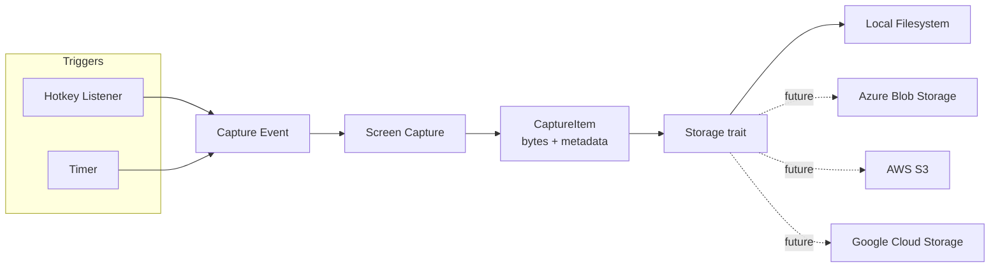

# ChronoKeySnap

A cross-platform Rust application that captures screenshots on a hotkey press or a
timer, and saves them to a configurable storage backend.

## Status

v1 implemented and manually tested: hotkey + timer triggers, cross-platform
capture via `xcap`, and local filesystem storage, wired together in
[src/main.rs](src/main.rs). See [Known limitations](#known-limitations) for a
caveat found while testing on ChromeOS Crostini. Cloud storage backends
(Azure/AWS/GCS) are still just design/roadmap items, not implemented.

## Functionality

- **Trigger a capture** in one of two ways:
  - **Hotkey** — a global, system-wide keyboard shortcut, registered via the
    `global-hotkey` crate. Works while the app runs in the background (it's a
    CLI process; there's no tray icon/GUI yet).
  - **Timer** — capture automatically every N seconds.
  - Both triggers can be enabled at the same time.
- **Capture the screen(s)** — currently captures every connected monitor on
  each trigger (one `CaptureItem` per monitor, PNG-encoded in memory).
  Capturing a single chosen monitor or a selected region is not implemented
  yet.
- **Save the screenshot** to a configured **storage backend**. The first version
  only supports the local filesystem; the storage layer is designed so that
  additional backends can be added without touching the capture/trigger logic.
- Run cross-platform: Windows, macOS, Linux.

## Non-goals (for v1)

- No image editing/annotation.
- No cloud backends yet (Azure/AWS/GCP are planned, not implemented).
- No GUI beyond a minimal system tray icon / config file (CLI + config-driven).

## Architecture



### Triggers

Hotkeys and the timer are independent sources that both emit the same internal
event when a capture should happen. This keeps the capture/storage pipeline
agnostic of *why* it was invoked.

- **Hotkey**: a global keyboard shortcut registered with the OS, configurable
  (e.g. `Ctrl+Alt+Shift+S`).
- **Timer**: a fixed interval, configurable (e.g. every 60s).

### Capture

Grabs the current screen contents into memory (no temp files) and produces a
`CaptureItem`:

```rust
struct CaptureItem {
    image: Vec<u8>,       // encoded image bytes
    format: ImageFormat,   // Png (only format implemented so far)
    timestamp: DateTime<Utc>,
    monitor_id: Option<String>,
}
```

### Storage abstraction

The key extensibility point of the app. Storage is defined as a trait so any
backend can be plugged in behind it:

```rust
#[async_trait]
trait Storage: Send + Sync {
    /// Persist a captured item and return where it ended up (path, URL, key...).
    async fn save(&self, item: &CaptureItem) -> Result<StorageLocation>;
}
```

- **v1 — Local filesystem** (implemented): saves each `CaptureItem` as a file in a
  configurable, pre-defined folder, named from its timestamp
  (e.g. `2026-09-15_14-30-05.000.png`).
- **Planned — Azure Blob Storage**: uploads to a configured container.
- **Planned — AWS S3**: uploads to a configured bucket.
- **Planned — Google Cloud Storage**: uploads to a configured bucket.

Cloud backends aren't implemented yet, and there's no Cargo feature-flag
split currently — the crate only depends on what local storage needs. Once a
cloud backend is added, gating each one behind its own feature flag (so
unused cloud SDKs aren't compiled in) is the planned approach.

### Configuration

A single config file (TOML) controls trigger and storage settings, e.g.:

```toml
[trigger.hotkey]
enabled = true
combination = "Ctrl+Alt+Shift+S"

[trigger.timer]
enabled = true
interval_seconds = 10

[storage]
backend = "local"

[storage.local]
folder = "~/Pictures/ChronoKeySnap"
```

Future backend sections (`[storage.azure]`, `[storage.aws]`, `[storage.gcs]`)
will hold backend-specific settings (container/bucket name, region, credential
references, etc.) without changing the overall shape of the config.

### Configuration file location

When `--config <path>` isn't passed, the app looks for `config.toml` in the
platform's standard config directory, under a `chronokeysnap` subfolder:

| OS      | Path                                                |
|---------|------------------------------------------------------|
| Linux   | `~/.config/chronokeysnap/config.toml`                |
| macOS   | `~/Library/Application Support/chronokeysnap/config.toml` |
| Windows | `%APPDATA%\chronokeysnap\config.toml` (typically `C:\Users\<user>\AppData\Roaming\chronokeysnap\config.toml`) |

If the file doesn't exist, built-in defaults are used (see above).

### Creating a config file

Run with `--init` to write a default config file to the platform config path
(or wherever `--config` points), so you have something to edit instead of
copying the example by hand:

```sh
cargo run -- --init            # writes to the default platform path
cargo run -- --config ./my.toml --init   # writes to a custom path instead
cargo run -- --init --force    # overwrite an existing config file
```

`--init` refuses to overwrite an existing file unless `--force` is also
passed, and exits immediately after writing (it doesn't start the app).

## Planned project structure

```
src/
  main.rs        # orchestration / event loop
  config.rs      # app configuration (serde + toml)
  capture.rs     # screenshot capture (cross-platform)
  trigger/
    hotkey.rs    # global hotkey listener
    timer.rs     # interval-based trigger
  storage/
    mod.rs       # Storage trait + CaptureItem + StorageLocation
    local.rs     # local filesystem backend
```

As cloud backends are added, `storage/` may be split into a Cargo workspace
(`storage-core`, `storage-local`, `storage-azure`, `storage-aws`, `storage-gcs`)
if the crate grows large enough to warrant it.

## Candidate crates (to be validated during implementation)

- Screen capture: `xcap`
- Global hotkeys: `global-hotkey`
- Async runtime: `tokio`
- Image encoding: `image`
- Config parsing: `serde`, `toml`
- CLI: `clap`
- Logging: `tracing`

## Building

Requires a recent stable [Rust toolchain](https://rustup.rs/) (install via `rustup`).

```sh
git clone https://github.com/belablotski/chronokeysnap.git
cd chronokeysnap
cargo build            # debug build, or:
cargo build --release   # optimized binary in target/release/
cargo run -- --init     # generate a config file to edit
cargo run               # run it
```

### Linux prerequisites

The `xcap` crate needs `libclang` (for `bindgen`) and PipeWire headers at build
time. On Debian/Ubuntu:

```sh
sudo apt-get install -y libclang-dev clang libpipewire-0.3-dev
```

Other distros: install the equivalent `clang`/`libclang` and PipeWire
development packages via your package manager (e.g. `clang`, `pipewire-devel`
on Fedora; `clang`, `pipewire` on Arch).

#### "Unable to find libclang"

If the build still can't find `libclang.so` (some distros install it under a
versioned LLVM path, e.g. `/usr/lib/llvm-14/lib`), point `bindgen` at it via a
*local, untracked* `.cargo/config.toml`:

```toml
[env]
LIBCLANG_PATH = "/usr/lib/llvm-14/lib"  # adjust to your system
```

This file is git-ignored on purpose — the path is machine-specific and would
break builds on other platforms if committed.

### Windows prerequisites

Install Rust via [rustup](https://rustup.rs/) (the `stable-x86_64-pc-windows-msvc`
toolchain) along with the "Desktop development with C++" workload from the
[Visual Studio Build Tools](https://visualstudio.microsoft.com/downloads/#build-tools-for-visual-studio)
(needed for the MSVC linker that Rust uses on Windows). No `libclang`/PipeWire
setup is needed — `xcap` and `global-hotkey` use native Windows APIs on this
platform, so no extra system dependencies are required beyond that.

### macOS prerequisites

Install the Xcode Command Line Tools (`xcode-select --install`) for a C
toolchain/linker. No other system dependencies are required.

## Known limitations

### Global hotkeys don't work under ChromeOS Crostini (sommelier)

The `global-hotkey` crate has no native Wayland backend (only X11, Windows,
macOS) — it registers hotkeys via `XGrabKey` against an X11/XWayland server.
On ChromeOS's Crostini container, the compositor (`sommelier`) runs apps as
native Wayland/ChromeOS surfaces, not XWayland clients (verified with
`xwininfo -root -tree`: only Sommelier's own internal windows exist on the X
display). Keystrokes typed into a native Wayland terminal or editor never
enter the X11 protocol layer at all, so the grab has no way to see them,
regardless of which window has focus.

This is an environment/library limitation, not an app bug — on a real X11
desktop, or on macOS/Windows (which use native OS APIs instead of X11), the
hotkey trigger works normally. If you're developing/testing inside Crostini,
use the **timer trigger** instead (`[trigger.timer].enabled = true`), since it
doesn't depend on the window server at all.

### Screen capture also fails under ChromeOS Crostini (sommelier)

Even with the timer trigger, actual capture fails on this environment too:
`xcap`'s Wayland backend (`libwayshot`) requires the compositor to implement
the `zxdg_output_manager_v1` protocol to enumerate monitors, which `sommelier`
does not. Every capture attempt logs an error (and the underlying library
panics internally rather than returning an error — the app catches this via
`spawn_blocking` so it doesn't crash, but the capture itself never succeeds).

This is a compositor limitation of this specific dev environment, not an app
bug. On a real Linux desktop (X11 or a standards-compliant Wayland compositor
like GNOME/KDE), macOS, or Windows, capture should work normally.

## License

Apache License 2.0 — see [LICENSE](LICENSE).
