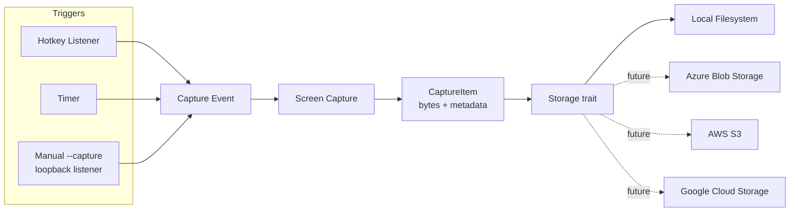

# ChronoKeySnap

A cross-platform Rust application that captures screenshots on a hotkey press or a
timer, and saves them to a configurable storage backend.

## Status

v1 implemented and manually tested: hotkey + timer triggers, cross-platform
capture via `xcap`, and local filesystem storage, wired together in
[src/main.rs](src/main.rs). See [Known limitations](#known-limitations) for a
caveat found while testing on ChromeOS Crostini. Cloud storage backends
(Azure/AWS/GCS) are still just design/roadmap items, not implemented.

## Functionality

- **Trigger a capture** in one of three ways:
  - **Hotkey** — a global, system-wide keyboard shortcut, registered via the
    `global-hotkey` crate. Works while the app runs in the background (it's a
    CLI process; there's no tray icon/GUI yet). Requires OS/compositor support
    for global key grabbing — see [Known limitations](#known-limitations) for
    platforms where this doesn't work.
  - **Timer** — capture automatically every N seconds.
  - **Manual** — a loopback-only "capture now" request: run
    `chronokeysnap --capture` to trigger a capture on an already-running
    instance. Works everywhere, including platforms where global hotkeys
    can't (see [Known limitations](#known-limitations)).
  - Any combination of the three can be enabled at the same time.
- **Capture the screen(s)** — currently captures every connected monitor on
  each trigger (one `CaptureItem` per monitor, PNG-encoded in memory).
  Capturing a single chosen monitor or a selected region is not implemented
  yet.
- **Save the screenshot** to a configured **storage backend**. The first version
  only supports the local filesystem; the storage layer is designed so that
  additional backends can be added without touching the capture/trigger logic.
- Run cross-platform: Windows, macOS, Linux.

## Non-goals (for v1)

- No image editing/annotation.
- No cloud backends yet (Azure/AWS/GCP are planned, not implemented).
- No GUI beyond a minimal system tray icon / config file (CLI + config-driven).

## Architecture



### Triggers

Hotkey, timer, and manual are independent sources that all emit the same
internal `CaptureEvent` when a capture should happen. This keeps the
capture/storage pipeline agnostic of *why* it was invoked.

- **Hotkey**: a global keyboard shortcut registered with the OS, configurable
  (e.g. `Ctrl+Alt+Shift+S`).
- **Timer**: a fixed interval, configurable (e.g. every 60s).
- **Manual**: a loopback-only (`127.0.0.1`) TCP listener; any connection to it
  (e.g. from `chronokeysnap --capture`) requests one capture. No
  authentication — only safe because it's unreachable from other machines.
  See [Known limitations](#known-limitations) for why this trigger exists.

### Capture

Grabs the current screen contents into memory (no temp files) and produces a
`CaptureItem`:

```rust
struct CaptureItem {
    image: Vec<u8>,       // encoded image bytes
    format: ImageFormat,   // Png (only format implemented so far)
    timestamp: DateTime<Utc>,
    monitor_id: Option<String>,
}
```

### Storage abstraction

The key extensibility point of the app. Storage is defined as a trait so any
backend can be plugged in behind it:

```rust
#[async_trait]
trait Storage: Send + Sync {
    /// Persist a captured item and return where it ended up (path, URL, key...).
    async fn save(&self, item: &CaptureItem) -> Result<StorageLocation>;
}
```

- **v1 — Local filesystem** (implemented): saves each `CaptureItem` as a file in a
  configurable, pre-defined folder, named from its timestamp
  (e.g. `2026-09-15_14-30-05.000.png`).
- **Planned — Azure Blob Storage**: uploads to a configured container.
- **Planned — AWS S3**: uploads to a configured bucket.
- **Planned — Google Cloud Storage**: uploads to a configured bucket.

Cloud backends aren't implemented yet, and there's no Cargo feature-flag
split currently — the crate only depends on what local storage needs. Once a
cloud backend is added, gating each one behind its own feature flag (so
unused cloud SDKs aren't compiled in) is the planned approach.

### Configuration

A single config file (TOML) controls trigger and storage settings, e.g.:

```toml
[trigger.hotkey]
enabled = true
combination = "Ctrl+Alt+Shift+S"

[trigger.timer]
enabled = true
interval_seconds = 10

[trigger.manual]
enabled = false
port = 47812

[storage]
backend = "local"

[storage.local]
folder = "~/Pictures/ChronoKeySnap"
```

Future backend sections (`[storage.azure]`, `[storage.aws]`, `[storage.gcs]`)
will hold backend-specific settings (container/bucket name, region, credential
references, etc.) without changing the overall shape of the config.

### Command-line reference

| Flag | Description |
|------|-------------|
| `-c, --config <PATH>` | Use this config file instead of the platform default path. |
| `--init` | Write a default config file to the config path and exit (doesn't start the app). See [Creating a config file](#creating-a-config-file). |
| `--force` | Used with `--init` to overwrite an existing config file. |
| `--capture` | Connect to an already-running instance's manual trigger port and request one capture, then exit. Requires `[trigger.manual].enabled = true` in that instance's config. See [Known limitations](#known-limitations). |
| `-h, --help` | Print help (auto-generated by `clap`). |
| `-V, --version` | Print the version. |

With no flags, it loads the config and runs the capture loop until `Ctrl+C`.

### Configuration file location

When `--config <path>` isn't passed, the app looks for `config.toml` in the
platform's standard config directory, under a `chronokeysnap` subfolder:

| OS      | Path                                                |
|---------|------------------------------------------------------|
| Linux   | `~/.config/chronokeysnap/config.toml`                |
| macOS   | `~/Library/Application Support/chronokeysnap/config.toml` |
| Windows | `%APPDATA%\chronokeysnap\config.toml` (typically `C:\Users\<user>\AppData\Roaming\chronokeysnap\config.toml`) |

If the file doesn't exist, built-in defaults are used (see above).

### Creating a config file

Run with `--init` to write a default config file to the platform config path
(or wherever `--config` points), so you have something to edit instead of
copying the example by hand:

```sh
cargo run -- --init            # writes to the default platform path
cargo run -- --config ./my.toml --init   # writes to a custom path instead
cargo run -- --init --force    # overwrite an existing config file
```

`--init` refuses to overwrite an existing file unless `--force` is also
passed, and exits immediately after writing (it doesn't start the app).

## Project structure

```
src/
  main.rs        # orchestration / event loop
  config.rs      # app configuration (serde + toml)
  capture.rs     # screenshot capture (cross-platform)
  trigger/
    hotkey.rs    # global hotkey listener
    timer.rs     # interval-based trigger
    manual.rs    # loopback "--capture" trigger
  storage/
    mod.rs       # Storage trait + CaptureItem + StorageLocation
    local.rs     # local filesystem backend
```

As cloud backends are added, `storage/` may be split into a Cargo workspace
(`storage-core`, `storage-local`, `storage-azure`, `storage-aws`, `storage-gcs`)
if the crate grows large enough to warrant it.

## Candidate crates (to be validated during implementation)

- Screen capture: `xcap`
- Global hotkeys: `global-hotkey`
- Async runtime: `tokio`
- Image encoding: `image`
- Config parsing: `serde`, `toml`
- CLI: `clap`
- Logging: `tracing`

## Building

Requires a recent stable [Rust toolchain](https://rustup.rs/) (install via `rustup`).

```sh
git clone https://github.com/belablotski/chronokeysnap.git
cd chronokeysnap
cargo build            # debug build, or:
cargo build --release   # optimized binary in target/release/
cargo run -- --init     # generate a config file to edit
cargo run               # run it
```

### Linux prerequisites

The `xcap` crate needs `libclang` (for `bindgen`) and PipeWire headers at build
time. On Debian/Ubuntu:

```sh
sudo apt-get install -y libclang-dev clang libpipewire-0.3-dev
```

Other distros: install the equivalent `clang`/`libclang` and PipeWire
development packages via your package manager (e.g. `clang`, `pipewire-devel`
on Fedora; `clang`, `pipewire` on Arch).

#### "Unable to find libclang"

If the build still can't find `libclang.so` (some distros install it under a
versioned LLVM path, e.g. `/usr/lib/llvm-14/lib`), point `bindgen` at it via a
*local, untracked* `.cargo/config.toml`:

```toml
[env]
LIBCLANG_PATH = "/usr/lib/llvm-14/lib"  # adjust to your system
```

This file is git-ignored on purpose — the path is machine-specific and would
break builds on other platforms if committed.

### Windows prerequisites

Install Rust via [rustup](https://rustup.rs/) (the `stable-x86_64-pc-windows-msvc`
toolchain) along with the "Desktop development with C++" workload from the
[Visual Studio Build Tools](https://visualstudio.microsoft.com/downloads/#build-tools-for-visual-studio)
(needed for the MSVC linker that Rust uses on Windows). No `libclang`/PipeWire
setup is needed — `xcap` and `global-hotkey` use native Windows APIs on this
platform, so no extra system dependencies are required beyond that.

### macOS prerequisites

Install the Xcode Command Line Tools (`xcode-select --install`) for a C
toolchain/linker. No other system dependencies are required.

## Known limitations

### Global hotkeys don't work under ChromeOS Crostini (sommelier)

**The problem:** on a ChromeOS Crostini container, the hotkey trigger silently
registers without error but never fires, no matter which window has focus.

**Root cause**, confirmed by direct investigation, not guesswork:

- `global-hotkey` has no native Wayland backend (its `platform_impl/` only has
  `x11`, `windows`, `macos`) \u2014 it grabs hotkeys via `XGrabKey` against an
  X11/XWayland server.
- Crostini's compositor (`sommelier`) runs apps as native Wayland/ChromeOS
  surfaces, not XWayland clients. Verified with `xwininfo -root -tree`: the
  only windows on the X11 display are Sommelier's own internal ones \u2014 real
  app windows (terminal, editor, etc.) never touch the X11 protocol layer at
  all. `xev -event keyboard` confirms the X server itself sees key events
  fine (e.g. `Ctrl+Alt+Shift+S` shows up correctly) when an X11 client (like
  `xev`) has focus \u2014 the X server isn't broken, it's just irrelevant to the
  apps you actually use.
- The correct Wayland-native mechanism for this \u2014 the `xdg-desktop-portal`
  `org.freedesktop.portal.GlobalShortcuts` interface \u2014 also isn't available:
  `busctl --user list` shows no `org.freedesktop.portal.Desktop` frontend
  registered, and ChromeOS's own portal backend
  (`org.freedesktop.impl.portal.desktop.cros`) exposes an empty object tree
  (no `GlobalShortcuts` implementation).
- Note: things like VS Code's own keybindings (`Ctrl+Shift+P`, etc.) working
  fine on the same machine isn't a counterexample \u2014 those are **in-app**
  keybindings that only require VS Code's own window to have focus, a
  completely different (and already-working) mechanism from a **global**
  hotkey that must fire while some *other* window has focus.

Both underlying mechanisms a Rust hotkey crate could use (X11 grab, Wayland
portal) are unavailable end-to-end in this environment, so this isn't
something fixable by changing our own code. On a real X11 desktop, a
standards-compliant Wayland compositor with portal support (e.g. GNOME 45+,
KDE Plasma 6+), macOS, or Windows, the hotkey trigger should work normally.

**Solution: the manual trigger.** Since neither global-hotkey mechanism is
available here, use the loopback **manual trigger** instead \u2014 it needs no
OS-level global input capture at all:

```toml
[trigger.manual]
enabled = true
port = 47812
```

```sh
cargo run                 # leave the daemon running
cargo run -- --capture    # from another terminal (or a script/shortcut), request one capture
```

This works identically on every platform, not just ChromeOS \u2014 it's a good
fallback anywhere a global hotkey isn't available or desired.

### Screen capture also fails under ChromeOS Crostini (sommelier)

Even with the timer or manual trigger, actual capture fails on this
environment too, on **both** of `xcap`'s Linux backends:

- **Wayland backend** (`libwayshot`, used by default here since
  `XDG_SESSION_TYPE=wayland`): requires the compositor to implement the
  `zxdg_output_manager_v1` protocol to enumerate monitors, which `sommelier`
  does not. The underlying library panics internally rather than returning an
  error \u2014 the app catches this via `spawn_blocking` so it doesn't crash, but
  the capture itself never succeeds.
- **X11/Xorg backend**: `xcap` picks this backend automatically when
  `WAYLAND_DISPLAY`/`XDG_SESSION_TYPE` aren't set (confirmed by forcing it via
  `env -u WAYLAND_DISPLAY -u XDG_SESSION_TYPE`). This avoids the panic (it
  returns a clean error instead), but capture still fails: an X11 `GetImage`
  request against the root window comes back `BadMatch`. `sommelier` is a
  minimal X11-compatibility shim mainly for input/window forwarding \u2014 the
  earlier `xwininfo` check already showed it has no real client windows on
  the X11 display, and it apparently doesn't back the root window with actual
  framebuffer content `GetImage` can read either.

So neither backend `xcap` supports on Linux can capture pixels through
`sommelier`, for two independent reasons. This is a compositor limitation of
this specific dev environment, not an app bug. On a real Linux desktop (X11
or a standards-compliant Wayland compositor like GNOME/KDE), macOS, or
Windows, capture should work normally.

## License

Apache License 2.0 — see [LICENSE](LICENSE).
